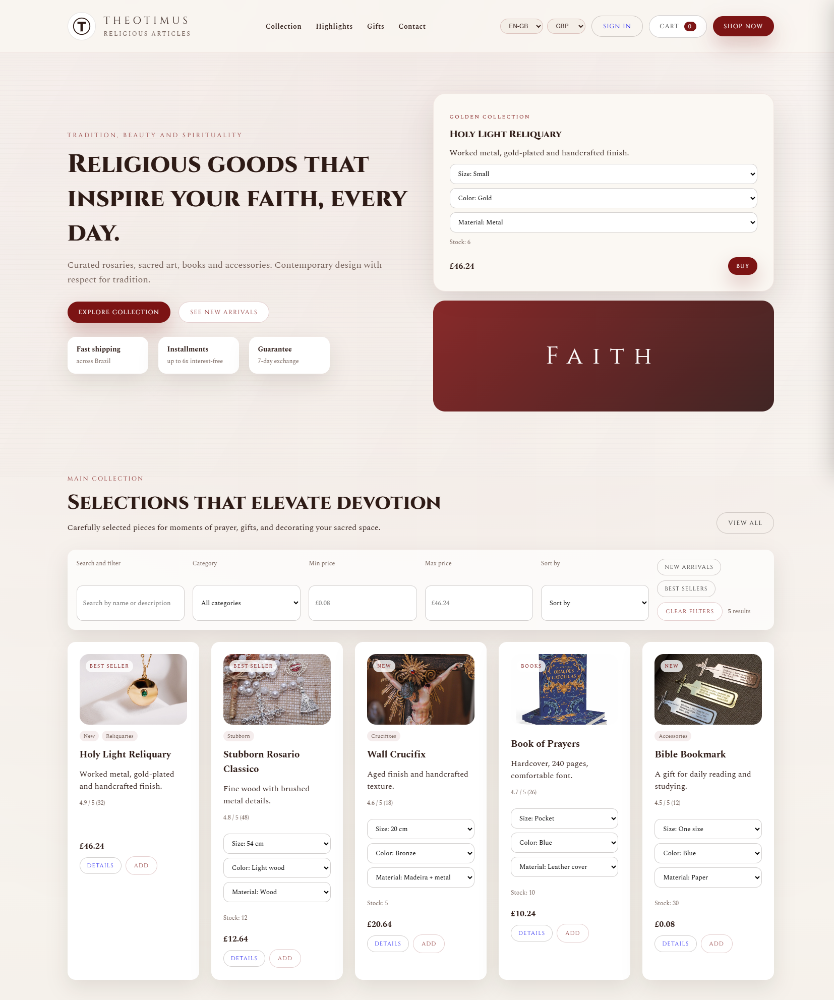
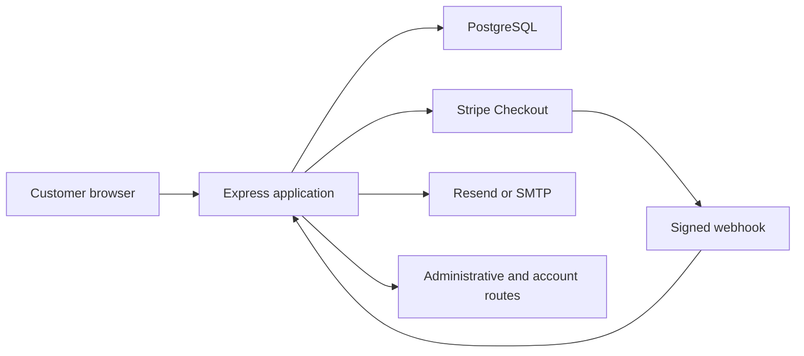

# Theotimus

[](https://github.com/DegsTerin/Theotimus/actions/workflows/quality.yml)
[](LICENSE)

Theotimus is a bilingual e-commerce application for religious articles. The project combines a responsive storefront with a Node.js backend, payment processing, order persistence and transactional communication.

**Live application:** [https://theotimus.onrender.com/](https://theotimus.onrender.com/)

## Storefront Preview

| Home | Product catalogue | Responsive storefront |
|---|---|---|
|  |  |  |

## Engineering Scope

- Responsive storefront in Brazilian Portuguese and British English
- Currency selection for BRL, USD, EUR and GBP
- Node.js and Express backend
- Stripe checkout and webhook handling
- PostgreSQL order and account-session persistence
- Transactional email through Resend or SMTP/Nodemailer
- Product, coupon, checkout and customer-account flows
- Automated flow tests with Playwright

## Technology Stack

| Layer | Technologies |
|---|---|
| Frontend | HTML, CSS and JavaScript |
| Backend | Node.js and Express |
| Database | PostgreSQL |
| Payments | Stripe Checkout and webhooks |
| Email | Resend and Nodemailer |
| Testing | Playwright |

## Architecture



Secrets and credentials are supplied through environment variables. The repository contains only documented placeholders in `.env.example`.

## Local Setup

1. Clone the repository and install dependencies:

```bash
git clone https://github.com/DegsTerin/Theotimus.git
cd Theotimus
npm install
```

2. Create a `.env` file with the services you intend to use:

```env
PORT=4242
STRIPE_SECRET_KEY=your_test_key
STRIPE_WEBHOOK_SECRET=your_test_webhook_secret
DATABASE_URL=your_postgresql_connection_string
RESEND_API_KEY=your_resend_key
RESEND_FROM=your_verified_sender
```

3. Start the application:

```bash
npm start
```

The server runs on `http://localhost:4242` by default.

## Tests

Run deterministic syntax checks with:

```bash
npm test
```

Run the deployed Playwright flow tests explicitly with:

```bash
npm run test:flows
```

Use Stripe test credentials and non-production service accounts for local development.

The GitHub Actions quality workflow runs only the deterministic checks. It does not initiate checkout or call payment services.

## Security Notes

- Never commit `.env`, API keys, webhook secrets or database credentials.
- Validate Stripe webhook signatures before processing payment events.
- Use HTTPS and managed secrets in deployed environments.
- Keep customer and order data out of logs and public test fixtures.

## License

This project is released under the [MIT License](LICENSE).

